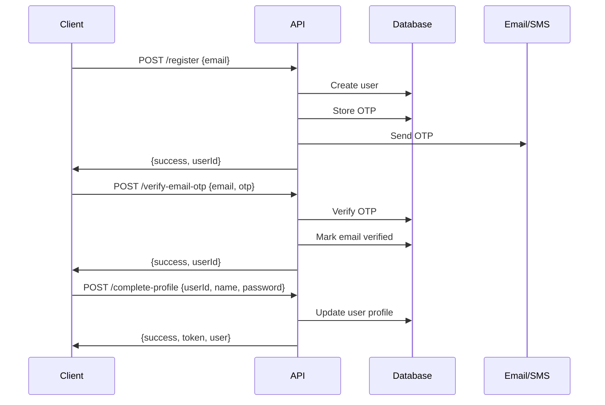
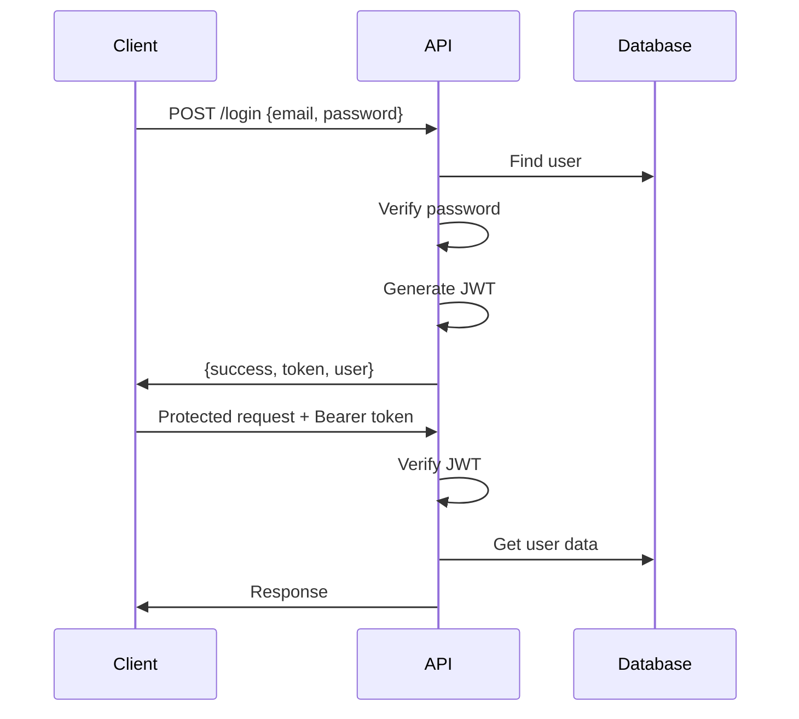

# 📚 API Documentation

## Overview

This document provides comprehensive information about the LMS Authentication API. For interactive documentation, visit `/api-docs` when the server is running.

## Base URL

```
Development: http://localhost:3000
Production:  https://api.lms.com
```

## Interactive Documentation

Access the Swagger UI documentation at:
```
http://localhost:3000/api-docs
```

Features:
- ✅ Try out API endpoints directly from the browser
- ✅ View request/response schemas
- ✅ Test with authentication
- ✅ See example requests and responses
- ✅ Download OpenAPI specification

## Authentication

Most endpoints require JWT authentication. Include the token in the Authorization header:

```http
Authorization: Bearer <your_jwt_token>
```

### Getting a Token

Obtain a token by:
1. Registering and completing profile (`/api/user-auth/register` → `/api/user-auth/complete-profile`)
2. Logging in (`/api/user-auth/login`)
3. Admin login (`/api/admin-auth/login`)

## API Endpoints

### 🔐 Authentication Endpoints

#### 1. Register User
```http
POST /api/user-auth/register
Content-Type: application/json

{
  "email": "user@example.com"
}
// OR
{
  "phoneNumber": "+1234567890"
}
```

**Response:**
```json
{
  "success": true,
  "message": "OTP sent to your email",
  "userId": "123e4567-e89b-12d3-a456-426614174000"
}
```

---

#### 2. Verify Email OTP
```http
POST /api/user-auth/verify-email-otp
Content-Type: application/json

{
  "email": "user@example.com",
  "otp": "123456"
}
```

**Response:**
```json
{
  "success": true,
  "message": "Email verified successfully",
  "userId": "123e4567-e89b-12d3-a456-426614174000"
}
```

---

#### 3. Verify Phone OTP
```http
POST /api/user-auth/verify-phone-otp
Content-Type: application/json

{
  "phoneNumber": "+1234567890",
  "otp": "123456"
}
```

**Response:**
```json
{
  "success": true,
  "message": "Phone number verified successfully",
  "userId": "123e4567-e89b-12d3-a456-426614174000"
}
```

---

#### 4. Complete Profile
```http
POST /api/user-auth/complete-profile
Content-Type: application/json

{
  "userId": "123e4567-e89b-12d3-a456-426614174000",
  "name": "John Doe",
  "password": "SecurePassword123!"
}
```

**Response:**
```json
{
  "success": true,
  "message": "Profile completed successfully",
  "token": "eyJhbGciOiJIUzI1NiIsInR5cCI6IkpXVCJ9...",
  "user": {
    "id": "123e4567-e89b-12d3-a456-426614174000",
    "name": "John Doe",
    "email": "user@example.com",
    "emailVerified": true,
    "isProfileComplete": true,
    "role": "USER"
  }
}
```

---

#### 5. Login
```http
POST /api/user-auth/login
Content-Type: application/json

{
  "emailOrPhone": "user@example.com",
  "password": "SecurePassword123!"
}
```

**Response:**
```json
{
  "success": true,
  "message": "Login successful",
  "token": "eyJhbGciOiJIUzI1NiIsInR5cCI6IkpXVCJ9...",
  "user": {
    "id": "123e4567-e89b-12d3-a456-426614174000",
    "name": "John Doe",
    "email": "user@example.com",
    "role": "USER"
  }
}
```

---

#### 6. Forgot Password
```http
POST /api/user-auth/forgot-password
Content-Type: application/json

{
  "email": "user@example.com"
}
// OR
{
  "phoneNumber": "+1234567890"
}
```

**Response:**
```json
{
  "success": true,
  "message": "OTP sent to your email"
}
```

---

#### 7. Reset Password
```http
POST /api/user-auth/reset-password
Content-Type: application/json

{
  "email": "user@example.com",
  "otp": "123456",
  "newPassword": "NewSecurePassword123!"
}
```

**Response:**
```json
{
  "success": true,
  "message": "Password reset successful",
  "token": "eyJhbGciOiJIUzI1NiIsInR5cCI6IkpXVCJ9..."
}
```

---

### 👤 Profile Management (Protected)

#### 8. Request Email Change
```http
POST /api/user-auth/request-email-change
Authorization: Bearer <token>
Content-Type: application/json

{
  "newEmail": "newemail@example.com"
}
```

**Response:**
```json
{
  "success": true,
  "message": "OTP sent to your new email address"
}
```

---

#### 9. Verify Email Change
```http
POST /api/user-auth/verify-email-change
Authorization: Bearer <token>
Content-Type: application/json

{
  "otp": "123456"
}
```

**Response:**
```json
{
  "success": true,
  "message": "Email updated successfully",
  "user": {
    "id": "123e4567-e89b-12d3-a456-426614174000",
    "email": "newemail@example.com"
  }
}
```

---

#### 10. Request Phone Change
```http
POST /api/user-auth/request-phone-change
Authorization: Bearer <token>
Content-Type: application/json

{
  "newPhoneNumber": "+9876543210"
}
```

---

#### 11. Verify Phone Change
```http
POST /api/user-auth/verify-phone-change
Authorization: Bearer <token>
Content-Type: application/json

{
  "otp": "123456"
}
```

---

#### 12. Get Auth Status
```http
GET /api/user-auth/auth/status
Authorization: Bearer <token>
```

**Response:**
```json
{
  "success": true,
  "authenticated": true,
  "user": {
    "id": "123e4567-e89b-12d3-a456-426614174000",
    "name": "John Doe",
    "email": "user@example.com",
    "emailVerified": true,
    "isProfileComplete": true
  }
}
```

---

### 🔑 Admin Endpoints

#### 13. Admin Login
```http
POST /api/admin-auth/login
Content-Type: application/json

{
  "email": "admin@example.com",
  "password": "admin123"
}
```

**Response:**
```json
{
  "success": true,
  "message": "Admin login successful",
  "token": "eyJhbGciOiJIUzI1NiIsInR5cCI6IkpXVCJ9...",
  "user": {
    "role": "ADMIN",
    "email": "admin@example.com"
  }
}
```

---

### 🏥 Health & Status

#### 14. Health Check
```http
GET /health
```

**Response:**
```json
{
  "status": "OK",
  "message": "Server is running",
  "timestamp": "2025-10-04T10:30:00.000Z",
  "database": "Connected",
  "environment": "development"
}
```

---

#### 15. API Info
```http
GET /api
```

**Response:**
```json
{
  "name": "LMS Authentication API",
  "version": "1.0.0",
  "description": "User authentication and profile management system",
  "endpoints": {
    "health": "/health",
    "userAuth": "/api/user-auth",
    "adminAuth": "/api/admin-auth",
    "docs": "/api-docs"
  }
}
```

---

## Error Responses

All error responses follow this format:

```json
{
  "success": false,
  "message": "Error description",
  "errors": ["Detailed error 1", "Detailed error 2"]
}
```

### Common HTTP Status Codes

| Code | Description |
|------|-------------|
| 200 | Success |
| 400 | Bad Request - Invalid input |
| 401 | Unauthorized - Invalid or missing token |
| 403 | Forbidden - Insufficient permissions |
| 404 | Not Found - Resource doesn't exist |
| 409 | Conflict - Resource already exists |
| 500 | Internal Server Error |

---

## Authentication Flow

### Complete Registration Flow



### Login Flow



---

## Rate Limiting

- **Registration**: 5 requests per hour per IP
- **Login**: 10 requests per 15 minutes per IP
- **OTP requests**: 3 requests per 10 minutes per user
- **Other endpoints**: 100 requests per 15 minutes per IP

---

## Testing with cURL

### Register
```bash
curl -X POST http://localhost:3000/api/user-auth/register \
  -H "Content-Type: application/json" \
  -d '{"email": "test@example.com"}'
```

### Login
```bash
curl -X POST http://localhost:3000/api/user-auth/login \
  -H "Content-Type: application/json" \
  -d '{"emailOrPhone": "test@example.com", "password": "password123"}'
```

### Protected Request
```bash
curl -X GET http://localhost:3000/api/user-auth/auth/status \
  -H "Authorization: Bearer YOUR_JWT_TOKEN"
```

---

## Testing with Postman

1. Import the OpenAPI specification from `/api-docs.json`
2. Set up an environment variable for `baseUrl` and `token`
3. Use Postman's authorization tab to set Bearer token
4. Test endpoints using the imported collection

---

## Swagger UI Features

Visit `http://localhost:3000/api-docs` to:

1. **View all endpoints** - Organized by tags
2. **Try it out** - Execute API calls directly
3. **Authenticate** - Click "Authorize" button, enter `Bearer <token>`
4. **View schemas** - See request/response structures
5. **Download spec** - Export OpenAPI specification

---

## Support

For more information:
- 📖 Main README: [README.md](./README.md)
- 🚀 Setup Guide: [SETUP.md](./SETUP.md)
- 📋 Quick Reference: [QUICK_REFERENCE.md](./QUICK_REFERENCE.md)
- 🏗️ Architecture: [ARCHITECTURE.md](./ARCHITECTURE.md)

---

**Last Updated**: October 4, 2025
