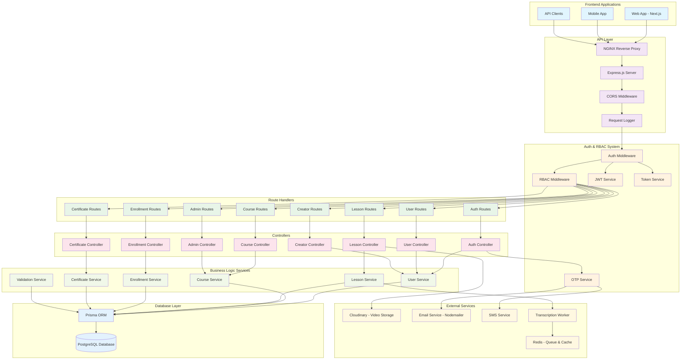
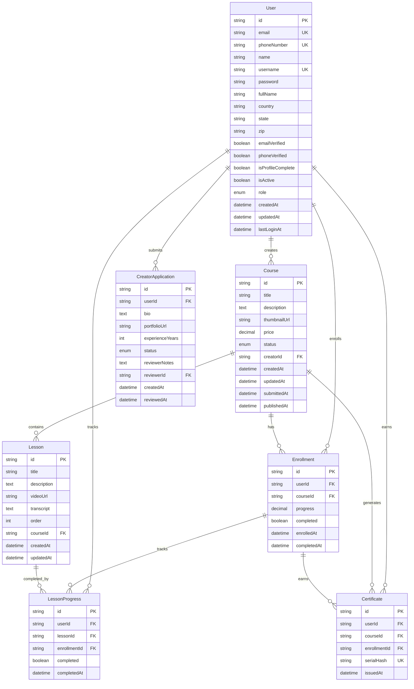
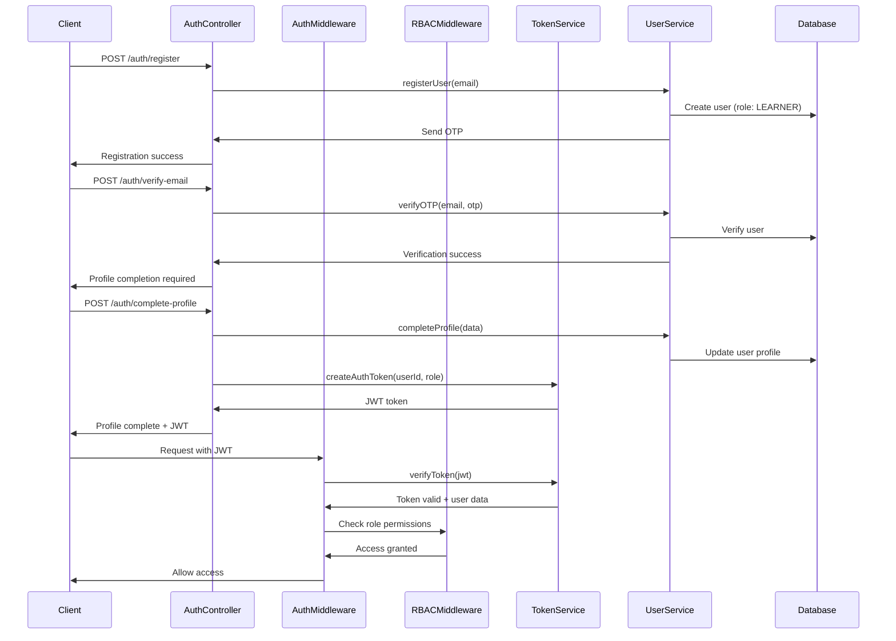
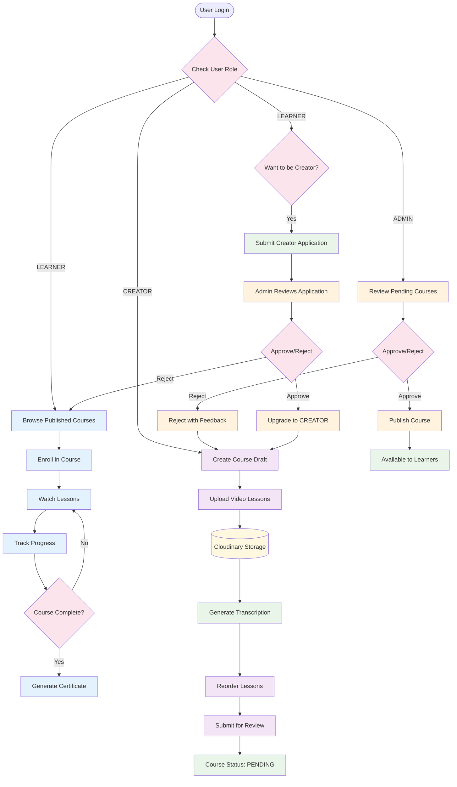
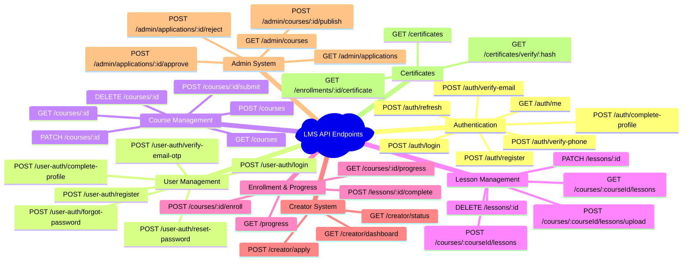
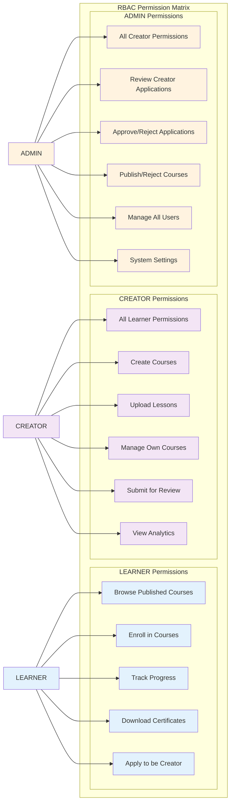
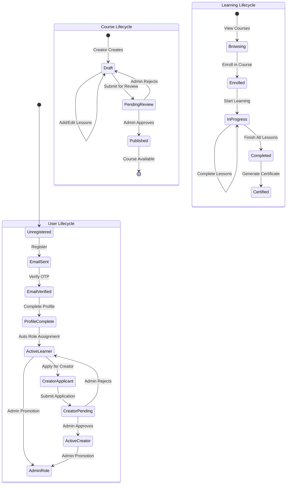

# LMS Backend Architecture & Database Schema

## Complete System Architecture

## Database Schema & Relationships

## Authentication & Authorization Flow

## Course Management Flow

## API Endpoints Overview

## Role-Based Access Control Matrix

## Data Flow & State Management

This comprehensive diagram shows:

1. **System Architecture**: Complete backend flow from frontend to database
2. **Database Schema**: All entities and their relationships
3. **Authentication Flow**: Step-by-step auth process
4. **Course Management**: Different user role workflows
5. **API Endpoints**: Organized by feature area
6. **RBAC Matrix**: Permission system breakdown
7. **State Management**: User, course, and learning lifecycles

The diagrams provide a complete visual representation of your LMS backend architecture and can be used for documentation, onboarding new developers, or system design discussions.
